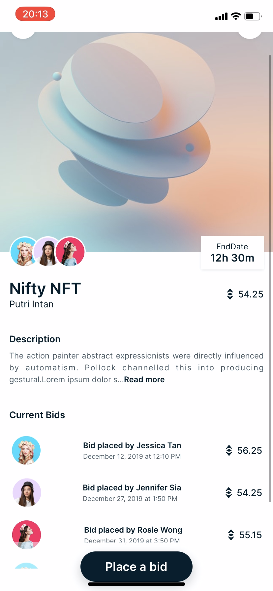
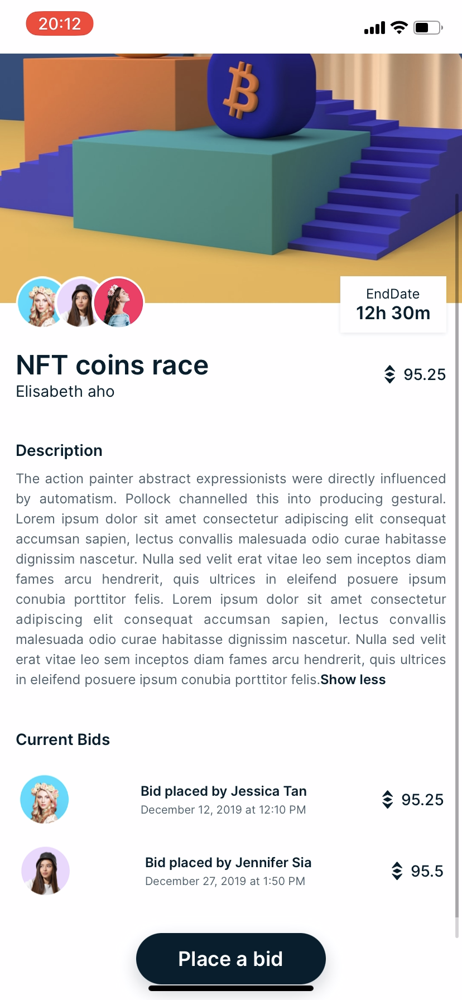
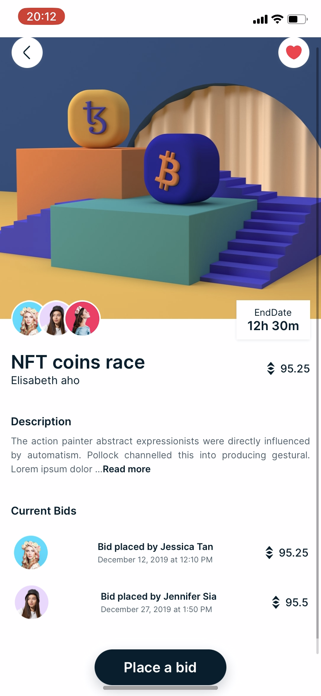
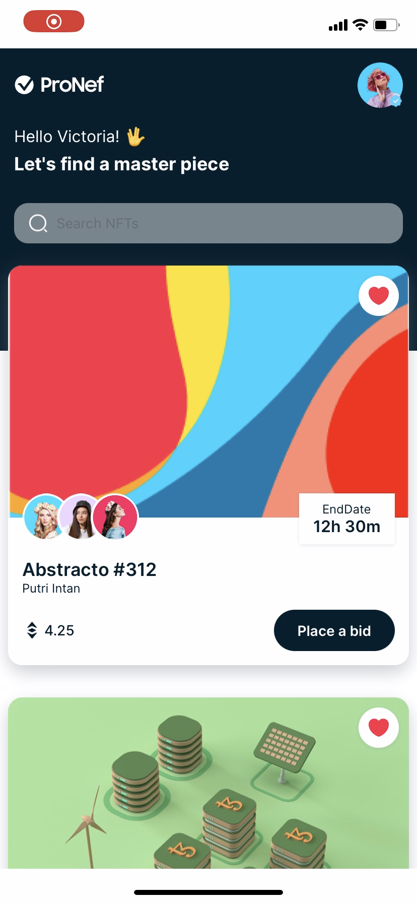

## NFT Marketplace (React Native) 

Welcome to **NFT Marketplace**! This app is built with React Native and provides a platform to buy, sell, and explore unique digital assets known as NFTs (Non-Fungible Tokens). 

## About the App

Creating the NFT Marketplace was a joy. The app is designed to be user-friendly, allowing you to:
- Browse a diverse collection of NFTs
- Emulate a purchase of NFTs using cryptocurrency
- List your NFTs for sale
- View detailed information and history of each NFT

## Features

- **User Authentication**: Secure sign-in and account management.
- **NFT Listings**: Explore various categories and discover new NFTs.
- **Purchase and Sales**: Seamless buying and selling process.

## Technologies Used

- **React Native**: For building a smooth and responsive mobile application.

- ### Here are some screenshots of the project:

<div>
   

   

   
  
    
</div>

## Getting Started

To get started with the app, follow these simple steps:

1. Clone the repository:
   ```sh
   git clone https://github.com/yourusername/NFT-Marketplace.git
   ```
2. Navigate to the project directory:
   ```sh
   cd NFT-Marketplace
   ```
3. Install dependencies:
   ```sh
   npm install
   ```
4. Run the app:
   ```sh
   npm start
   ```

Enjoy exploring and trading in the NFT world with NFT Marketplace! 

If you have any questions or need further assistance, feel free to open an issue or contact me directly. Thank you for checking out my project!
The application is entirely responsible. 


